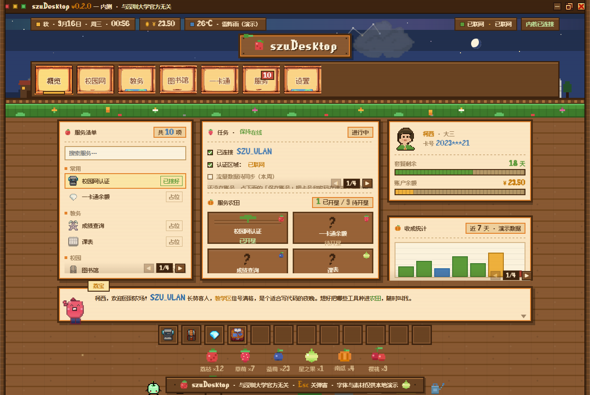
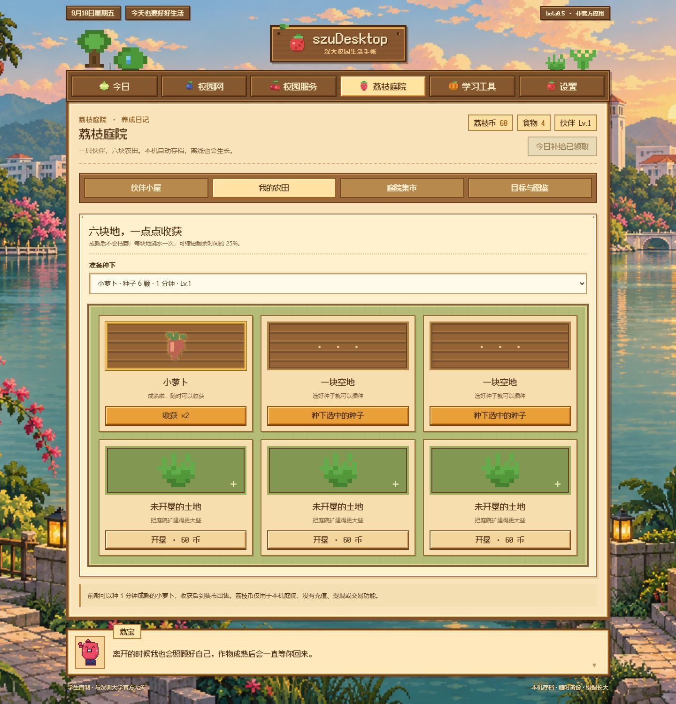
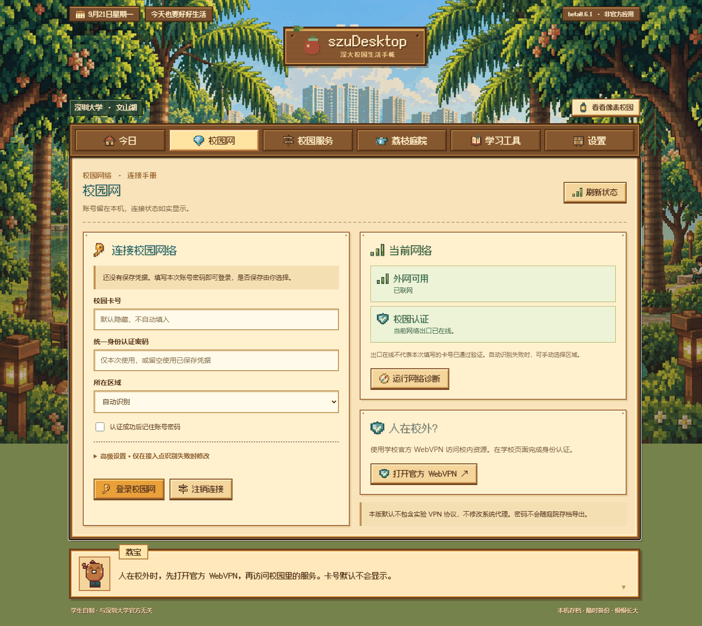

<div align="center">

# szuDesktop · Lychee Garden

A small green corner for everyday life at Shenzhen University: the campus network,
school services, study tools, and a little garden that keeps growing even offline.

<p>
  
  
  
  
  
</p>

[简体中文](../README.md) · **English**

Unofficial · Built by a student · Not affiliated with Shenzhen University

[Download](#download) · [Features](#features) · [Command line](#command-line-szunet) · [FAQ](#faq) · [Privacy](#privacy-and-security) · [Development status](STATUS.md)

</div>

---

## Preview

| Main window | Lychee Garden | Network sign-in |
| :---------: | :-----------: | :-------------: |
|  |  |  |

---

## What it solves

The campus network at Shenzhen University is split into **two zones that do not
work with each other**, each using a completely different sign-in method:

| Zone | System | How it works |
| :--- | :----- | :----------- |
| Teaching / office / library areas | SRun (深澜) | Rolled out in early 2025. Password goes through HMAC-MD5, user data through XXTEA with a custom Base64, plus a SHA1 checksum |
| Dormitory / staff areas | Dr.COM (ePortal) | A single GET request is enough |

That creates two headaches:

1. **Every tutorial and script written before 2024 fails in the teaching area** —
   they were all built for the old Dr.COM.
2. **Nobody explains the error messages** — `ldap auth error`, `Rad:userid error1`,
   `登陆失败[05]`, `Unknow ac-type`… so people just guess and retry.

szuDesktop handles both: **one button to sign in, one button to tell you where it got stuck.**

It does not decide the zone by "can I reach the portal". It looks at the **protocol
fingerprint** — the handshake behaviour that only that protocol has (SRun: whether
`get_challenge` succeeds; Dr.COM: whether the ePortal login endpoint exists). The reason is
practical: the dorm portal also returns HTTP 200 on machines in the teaching area, so a
plain reachability test mis-detects the zone while offline and then fires the Dr.COM
protocol at an endpoint that isn't there.

---

## Download

Grab `szudesktop-<version>-windows-amd64.zip` from the
[Releases](https://github.com/SzuDesktopTeam/szudesktop/releases) page, unzip it anywhere,
and double-click `szudesktop.exe`. **No installer — just unzip and run.**

| Item | Detail |
| :--- | :----- |
| Desktop app | Windows x64 (`szudesktop.exe`) |
| Command line | Windows / macOS / Linux, single binary `szunet` |
| Current version | [beta0.7.2](https://github.com/SzuDesktopTeam/szudesktop/releases/tag/beta0.7.2) · public beta (pre-release); Windows download published |
| Runtime | No dependencies to install; the window is provided by your browser (Edge / Chrome app window) |

### First run

1. Open the app and go to **Campus network**
2. Enter your campus card number and unified identity password; tick "remember" if you
   don't want to type it every time
3. Press **Sign in** — it detects whether you're in the teaching or dorm area and uses
   the matching protocol
4. If it fails, press **Diagnostics** — it lists the zone decision, portal reachability,
   protocol fingerprint and what that means

### Opening and exiting

- Starting it twice with the same save file reuses the running local service instead of
  opening a second copy
- Closing **all** app windows exits automatically after about 10 seconds; to quit
  immediately use **Settings → Exit**
- Reloading the page does not stop the service
- To start the service without a window, launch `szudesktop.exe` with `--no-open`
- A short, skippable guide appears on first launch; it explains where your data lives,
  how to quit, and what to try first
- Autostart can be toggled in **Settings** (the CLI equivalent is `szunet autostart`).
  If its state cannot be read, the app says so instead of showing "off"

### Where my data lives

- Under the `.szunet` directory in your user profile by default
- Campus network passwords are stored per platform: Windows DPAPI (only this machine and
  this Windows account can decrypt them), the macOS Keychain, and Secret Service
  (`secret-tool`) on Linux. **There is no plain-text fallback on any platform:** when the
  system secure store is unavailable, saving fails with an explicit error instead of quietly
  writing a plain-text file (F24, fixed)
- Garden saves are `workspace-v1.json`, plain JSON you can back up yourself; an export
  never contains your campus account or password
- Before switching computers, export your save in Settings and import it on the new one

---

## Features

| Capability | Status | Notes |
| :--------- | :----- | :---- |
| Campus network sign-in | ✅ | Teaching area (SRun) / dorm area (Dr.COM), zone detected automatically; sign-out and manual zone override |
| Access point ID (`ac_id`) discovery | ✅ | Tries in order: your manual value → what worked on this port before → the gateway redirect → a guess. Guesses are labelled as such |
| Connection diagnostics | ✅ | Lists zone decision, portal reachability, protocol fingerprint and the conclusion |
| Credential storage | ✅ | Windows DPAPI / macOS Keychain / Linux Secret Service; saved **only after a successful sign-in and only if you ticked "remember"**. Without a system secure store it refuses to save and says why — **no plain-text fallback** (F24, fixed). The macOS save path has not been validated on real hardware (F25) |
| Notices | Partial | Current source groups notices by college or department: 28 academic-unit links, 17 readable college columns, plus Academic Affairs and the Graduate School. Dates and original links are preserved with a 10-minute cache; other units link to their official sites |
| Room availability and booking | Partial | Live community rooms and half-hour availability on the campus network (read-only). The interface opens the official school page for login and booking and never asks users to copy booking cookies. The server has **no booking write endpoints left** (F23, removed). Library services use a separate official system |
| Calendar and timetables | Partial | Official calendar updates and manual week overrides. Undergraduate personal timetable reading and graduate login are **pending full live account validation** |
| Study reminders | ✅ | Add a reminder manually, export a standard ICS calendar (15 minutes before start). **A reminder is not a booking** |
| Common contacts | Partial | Only numbers verifiable on official school pages (library help desks); other offices link to their official pages |
| Grades and GPA | Partial | Paste or import CSV / TSV grade tables for undergrad and postgrad, converted by the school's own rules. **No PDF / image / XLSX parsing, no automatic online sync** |
| Todo and focus timer | ✅ | Todo list plus 5 / 25 / 45-minute focus sessions |
| Lychee Garden | ✅ | Companion care and growth, crops, plots, watering, harvest, decorations, daily goals, achievements and a field guide. No purchases, no real-money trading |
| Save file | ✅ | Fixed local file, survives restarts and port changes, supports export / import and multi-window conflict protection |
| Launch at login | ✅ (Windows only) | Starts the service silently after Windows login and connects once, without opening a window; toggle and real registered state in Settings. macOS / Linux are unsupported and say so instead of failing silently |

beta0.7.2 is a public prerelease. Score reading remains limited to the first page; balance is not integrated. Timetables require manual queries and still await full live account validation. In the current source, reservations are completed on the official school page; embedding that page inside the app is not yet implemented. See [STATUS.md](STATUS.md).

**College notice filtering:** selecting a college automatically reads its public column. Unsupported units have an official-site link; authenticated internal notices are not included. This update is included in beta0.6.1.

**Booking usability fix:** since beta0.6.1 the interface no longer shows the booking cookie field, developer-tools instructions or the unverified local submission form. Availability is a read-only overview; the booking button opens the official school website in the browser, where you sign in and submit yourself. **Follow-up:** beta0.6.1 only withdrew the interface — `/api/booking/{session,history,prepare,commit}` stayed in the binary. Those four endpoints have now been **removed entirely** (F23); the booking module keeps only the read-only rooms and availability queries, so there is no code path left that can submit a reservation to the school. Embedded official pages and their full login flow remain unverified.

### Experimental score reading

Since beta0.6.1 the app includes undergraduate and graduate score readers, pending validation with real school records. Enter the Cookie only in the local application. Session storage fails closed if secure storage is unavailable — no plaintext fallback is used, and campus network passwords now follow the same rule (F24, fixed). Verification targets the selected academic application and distinguishes missing permission from an expired session. Only the first page is read; unknown totals and partial results are explicitly labelled. Community reservations are completed on the official school page; sports venues are not integrated.

The app provides the official academic calendar, local graduate login and timetable reading, and undergraduate personal timetable reading using a business-specific ehall cookie. Timetable adapters still require live account acceptance. Public community rooms and availability can be read on the campus network. Users open the official school page to sign in, submit a reservation, and view its result. The booking session input and experimental local submission interface shipped in beta0.6 were withdrawn from the interface in beta0.6.1, and the server endpoints have since been removed (F23). See [STATUS.md](STATUS.md) for current acceptance status.

---

## Command line szunet

For scripting, or when you don't want a window. Sources live in `cmd/szunet`;
build with `go build -o dist/szunet ./cmd/szunet`.

| Command | What it does |
| :------ | :----------- |
| `login` | Sign in (pass `-u` card number and `-p` password for one-off use; not saved) |
| `logout` | Sign out |
| `status` | Show current state |
| `detect` | Detect the current zone and access point ID |
| `diag` | Diagnostics: zone decision and protocol fingerprint |
| `config` | View / change local configuration |
| `autostart` | Configure launch at login (Windows only) |
| `vpn` | Guidance for the three official ways to reach the campus network from outside (WebVPN / EasyConnect / zero trust). **Guidance only — it contains no experimental VPN protocol code** |
| `version` | Show the version |

```text
szunet detect                       # which zone and access point ID it detects
szunet login --zone teaching        # force a protocol (auto / teaching / dorm)
szunet login --ac-id 12             # set the access point ID by hand
szunet diag                         # run this first when the network is down
```

Run `--help` for all flags. **Never put real credentials in shared scripts or logs.**

On macOS, credentials saved with `config set` go into the system keychain. Before writing, the
CLI self-checks that the write path works using a throwaway item; if it does not, it fails with a
clear error instead of falling back to putting the password on the command line (where other
processes on the same machine could see it).

**A defect worth stating plainly (F26):** the new macOS CI probe once hit `passwords don't match`
on real hardware — `security -w` **can** ask twice (password, then confirmation), while beta0.7.1
and beta0.7.2 fed it a single line. On such machines the macOS CLI **could not save credentials at
all**: it failed with a clear error, leaked nothing and wrote no plaintext, but the feature did not
work. The behaviour is not stable — the four later runs on the same image (macOS 26.6.2) asked only
once. It now feeds the password plus a confirmation line, which works in both cases (the "asks once"
case is verified on real hardware). **The fix is not released yet.** That probe no longer swallows
failures and now gates the release job. See F21 / F25 / F26 in STATUS.md.

---

## FAQ

<details>
<summary><b>Sign-in fails once I plug in my own router</b></summary>

Every network port on campus has its own access point ID (`ac_id`), and you have to report
the one for the port you're plugged into. Older versions always sent `1`, while the router
line expects `12`, and the server rejects a wrong ID outright.

The app now looks for the ID in this order, using the first one that works:

| Priority | Source | Confidence |
| :-- | :-- | :-- |
| 1 | You set it yourself (`--ac-id 12`) | Highest |
| 2 | What worked on **this port** on this machine before | High |
| 3 | Read from the gateway redirect when you're not signed in yet | Authoritative |
| 4 | Trying common IDs one by one | Low (shown as "guess") |

**The ID belongs to the wall port, not to the router**: same router back in its old port →
same ID; different port → different ID; different router in the same port → same ID.

If you see "authentication failed: wrong ac_id", run `szunet detect` to see what it found.
</details>

<details>
<summary><b>My antivirus flags it</b></summary>

It's a single-file program without a code-signing certificate, which triggers common
false positives. That said, **don't dismiss every warning as a false positive** — the code
is open source, so you can read it or build it yourself (`go build`) and compare behaviour.
</details>

<details>
<summary><b>Does it keep running after I close the window?</b></summary>

It exits about 10 seconds after you close **all** app windows. Reloading doesn't stop the
service. Use **Settings → Exit** to quit immediately.
</details>

<details>
<summary><b>Does it reconnect on its own in the background?</b></summary>

No. Whether to sign in is your call, made on the sign-in page. The app never fires
authentication requests on a timer behind your back.
</details>

<details>
<summary><b>Where is my password stored?</b></summary>

On Windows it's encrypted with DPAPI — only this machine and this Windows account can
decrypt it. macOS uses the system Keychain; Linux uses Secret Service. **No platform falls
back to plain text:** if the system secure store is unavailable, saving fails with an explicit
error, and "forget account" also removes any plain-text file an older version may have left
behind. It is saved **only after a successful sign-in and only if you ticked "remember"**, so
a wrong password won't overwrite the stored one. You can clear it at any time with
"forget account".
</details>

---

## Privacy and security

- **No data collection**: no telemetry, no analytics. Everything stays on your machine
- **Credentials encrypted locally**: Windows DPAPI, undecryptable on another machine or
  under another user account; macOS Keychain; Linux Secret Service. No plain-text fallback —
  saving fails with an explicit error when no system secure store is available
- **It never submits for you**: booking a room, picking courses, paying — the app gives you
  the entry point and reminders; the final action is yours, in the official system. The
  experimental server booking endpoints from beta0.6 have been removed entirely (F23), so no
  code path can submit a reservation
- **Loopback only**: the desktop service listens on `127.0.0.1` and refuses to start on a
  non-loopback address; every `/api/*` route checks Host, `Sec-Fetch-Site` and a same-origin
  `Origin`, returning 403 to any other page
- **Dorm-area sign-in is plain text**: the school's Dr.COM gateway is HTTP by default
  (`http://172.30.255.42`). That is the university's protocol, not this app's choice; the
  teaching-area SRun portal is HTTPS and **does** verify certificates
- **Nothing that bypasses billing or shares your connection**. Please follow your
  university's network rules
- **Official sources only**: notices are read from predefined school pages; the app is not
  a general-purpose web proxy

---

## Build and verify

You need Go (see `go.mod`), Python 3 and Node.js.

```text
python desktop/sync-assets.py      # sync interface assets
node   desktop/check-ui.mjs        # the 10 frontend regressions below all run in CI
node   desktop/check-campus.mjs
node   desktop/check-notices.mjs
node   desktop/check-session-ui.mjs
node   desktop/check-academic.mjs
node   desktop/check-school.mjs
node   desktop/check-booking.mjs
node   desktop/check-network-ui.mjs
node   desktop/check-workspace-ui.mjs
node   desktop/check-autostart-ui.mjs
go vet ./... && go test ./...      # static checks and unit tests
python desktop/check_release_notes.py # release-notes extraction regression
python desktop/build-windows.py    # build the Windows desktop app
python desktop/smoke_windows.py    # end-to-end smoke test
python desktop/make_release.py     # produce the release package (only when actually releasing; it overwrites same-named local artifacts)
```

Release notes live in the root [CHANGELOG.md](../CHANGELOG.md): when bumping the version,
rename the `## 未发布` ("unreleased") section to the new version. CI extracts that section as
the GitHub Release body and fails the release if it is missing or empty.
`python desktop/release_notes.py <version>` previews it locally.

The only interface sources are `desktop/index.html` and `desktop/assets/garden/`.
Don't hand-edit build outputs. The default desktop build **excludes the experimental VPN
protocol** and unverified third-party game artwork, and only links to the official WebVPN.
Experimental sources are kept for provenance review and protocol study, and must not be
presented as a finished, verified feature. The exclusion works through a build tag:
`internal/vpn` is referenced only from files guarded by `//go:build campusvpn`, and neither
CI nor the build scripts pass `-tags campusvpn`, so neither the desktop app nor the five CLI
release binaries contain that protocol code. The provenance and licensing of `internal/vpn`
are still unverified (STATUS.md F11): its package comment now says so plainly and makes no
claim of independent authorship, and F06 / F07 / F08 (false "connected" state, missing
timeouts, skipped certificate verification) are all still open. Until the provenance is
verified, this module must not be presented as a working feature or as clean-source code.

---

## Acknowledgements

- [teleostnacl/LoveSzu](https://github.com/teleostnacl/LoveSzu) — reference for undergraduate personal timetable endpoint and field names; implemented independently without copying its source code.
- [Fusion Pixel Font](https://github.com/TakWolf/fusion-pixel-font) — by TakWolf,
  SIL Open Font License 1.1; the licence ships with the package as `FONT-LICENSE-OFL.txt`
- [Sleepstars/SZU-login](https://github.com/Sleepstars/SZU-login) — attribution for the
  SRun xEncode implementation is kept in [LICENSE](../LICENSE)
- [Clash Verge Rev](https://github.com/clash-verge-rev/clash-verge-rev) and
  [FZU Helper](https://github.com/west2-online/fzuhelper-app) — references for interface
  hierarchy and how campus services are organised
- [MattDong123/tools4szu](https://github.com/MattDong123/tools4szu) — by Matt, used with the
  author's permission as research into the university's own system endpoints. No code was
  copied: the endpoint paths, dataset names and field names it documents were re-implemented
  in Go with explicit session-expiry detection. That repository declares no open-source
  licence, so this is an attribution of facts only and not a redistribution of its code

---

## Licence

MIT — see [LICENSE](../LICENSE).

Third-party components keep their own licences: Fusion Pixel Font is under OFL 1.1, and the
experimental VPN module's third-party provenance is still being verified and is not included
in default desktop builds. Names such as EasyConnect remain the property of their
respective owners.
